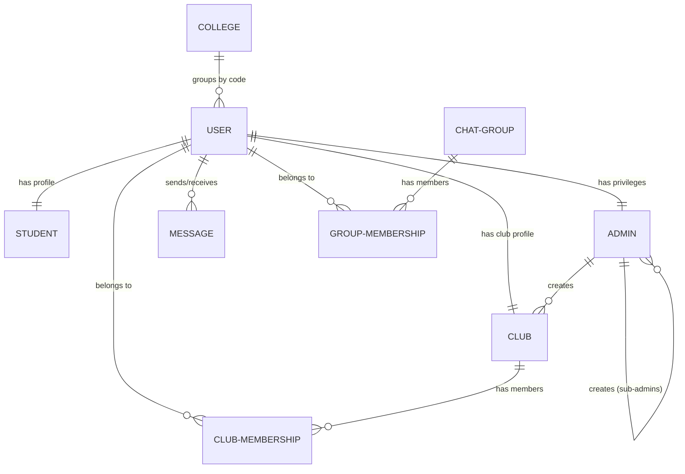

# Konnect Database Models & Relationships

This document explains the MongoDB schema architecture for Konnect, detailing the individual models and how they interconnect to form the platform's core logic.

## Core Architecture: The "User" Centric Design

The system follows a "Profile-Extension" pattern. The `User` model acts as the central authentication and identification hub, while specific roles (Student, Admin, Club, Faculty) have their own models that reference the `User` via `user_id`.

---

## 1. Primary Entities

### User (`user.model.ts`)
The root model for all entities. Every person or entity that logs in has a record here.
- **Key Fields**: `user_type` (Enum), `college_code`, `email_id`, `password_hash`, `public_key`, `private_key`.
- **Connections**: 
    - Referenced by `Student`, `Admin`, `Club`, `Faculty` via `user_id`.
    - Referenced by `Message` (Sender/Receiver).
    - Referenced by `Membership` models (Member).

### Admin (`admin.model.ts`)
Stores administrative privileges.
- **Connections**: 
    - `user_id` -> Points to `User`.
    - `created_by` -> Points to another `Admin` (for hierarchy).
    - Root admins are identified by `is_root_admin: true`.

### Student (`Student.model.ts`)
Stores student-specific metadata.
- **Connections**: 
    - `user_id` -> Points to `User`.
    - `blocked_user` -> Array of `User` IDs the student has personally blocked.

### Club (`club.model.ts`)
Represents an organization or club within a college.
- **Connections**: 
    - `user_id` -> Points to `User` (Clubs have their own login credentials).
    - `created_by` -> Points to the `Admin` who authorized the club.
    - `college_code` -> Matches the `College`.

### Faculty (`facultySchema.ts`)
Stores faculty-specific information.
- **Connections**: 
    - Currently acts as a standalone profile for faculty-type users.

### College (`college.model.ts`)
A master list of supported institutions.
- **Key Fields**: `college_code` (Unique identifier), `college_name`.
- **Connections**: 
    - Linked to `User`, `Club`, `Group`, and `Admin` via the `college_code` string.

---

## 2. Groups & Memberships

### Chat & Announcement Groups (`chatGroup.model.ts`, `announcementGroup.model.ts`)
- **Connections**: 
    - `created_by` -> Points to a `User`.
    - `college_code` -> Ensures the group is scoped to a specific institution.

### Membership Models (`chatGroupMembership.model.ts`, `announcementGroupMembership.model.ts`, `clubMembership.model.ts`)
These act as join tables to handle Many-to-Many relationships.
- **Connections**:
    - `member` / `member_id` -> Points to `User`.
    - `group` / `club_id` -> Points to the respective Group or Club.
    - `isAdmin` / `position` -> Defines the user's role within that specific group.

---

## 3. Interaction & Security

### Message (`message.model.ts`)
Handles E2EE messaging.
- **Connections**:
    - `sender` -> Points to `User`.
    - `receiver` -> Points to `User` (or a Group ID if `isGroupMessage` is true).
    - Stores `aes_key` which is used for the message payload.

### BlockedStudent (`blockedStudent.model.ts`)
An administrative audit log of students blocked at the college level.
- **Connections**:
    - `student_id` -> Points to `Student`.
    - `college_code` -> Links to the institution.

---

## Relationship Diagram (Conceptual)

## Naming Conventions
- **Internal Refs**: Most models use `user_id` to link back to the `User` document.
- **Scope**: `college_code` is the primary mechanism used across all models to ensure data isolation between different universities.
